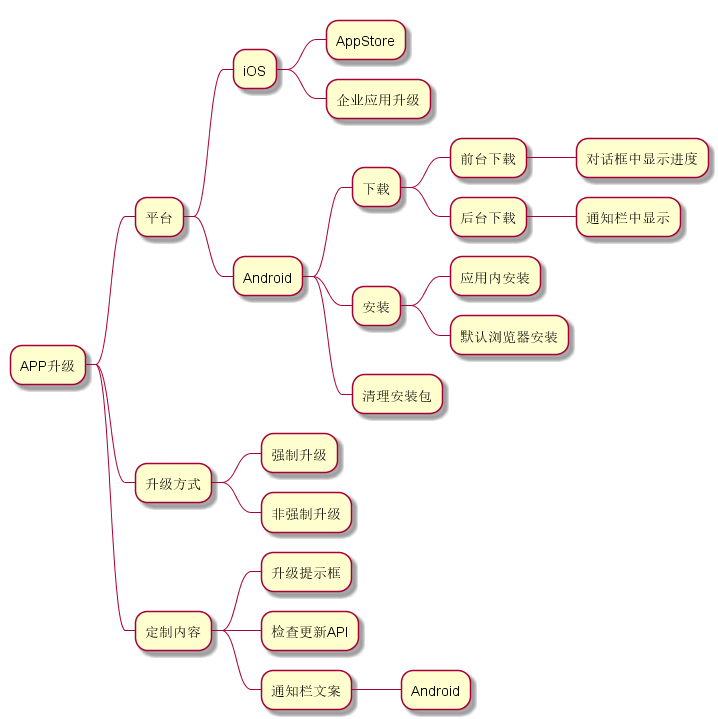

# upgrade

app 升级相关逻辑

## Features



### 未实现的功能

1. iOS AppStore 升级。
2. 安装完成后清理安装包。
3. Android通知栏文案定制。

## Getting Started

### 1. 添加依赖

```bash
cd project_root  
mkdir -p github
git clone https://github.com/JamesKarl/app_upgrade.git 
```

pubspec.yaml

```yaml
dependencies:
    flutter:
        sdk: flutter
    upgrade:
        path: github/app_upgrade
```

### 2. include upgrade.dart

`import 'package:upgrade/upgrade.dart';`

### 3. 实现自己的AppVersionChecker

```dart
abstract class AppVersionChecker {
  ///检查是否有新版本，有新版本返回AppInfo, 没有新版本返回null.
  Future<AppInfo> checkIfHasNewVersion();

  ///没有新版本时会回调这个接口
  Future<void> onNoNewVersion(BuildContext context);

  ///有新版本时会回调这个接口. 确认更新返回true，其它返回false
  Future<bool> onHasNewVersion(BuildContext context, AppInfo appInfo);

  ///下载app的过程，通常会显示一个带进度的下载对话框，最终返回app的下载地址。
  Future<String> onRequireDownloadApp(BuildContext context, AppInfo appInfo);
}
```

> 可以参考：example/lib/demo_checker.dart**

### 4. 调用接口触发检查更新

```dart
AppUpgrade.checkUpdate(
    context,
    checker: DemoChecker(
    forceUpgrade: false,
    installByBrowser: true,
    ),
    showMessageWhenNoNewVersion: true, ///当没有新版本时是否显示一个提示框。默认显示。
);
```

### 5. 从后台切换到前台时自动触发检查更新

```dart
class _MyAppState extends State<MyApp> with CheckAppUpgradeMixin<MyApp> {
  @override
  void initState() {
    super.initState();
  }

  @override
  Widget build(BuildContext context) {
    return MaterialApp(
      home: Homepage(),
    );
  }

  @override
  AppVersionChecker getAppVersionChecker() {
    return DemoChecker(forceUpgrade: false, installByBrowser: false);
  }
}
```

## 依赖

1. 安装及权限检查. [Blankj](https://github.com/Blankj/blankj.github.io)
